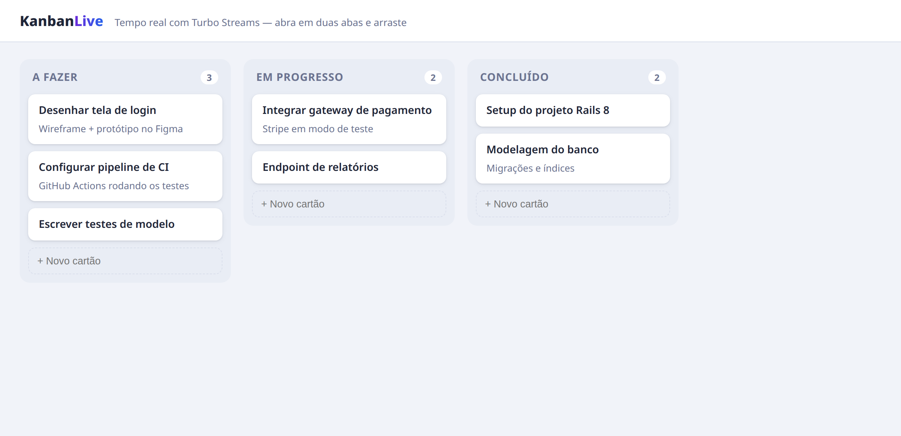

<div align="center">
  <h1>KanbanLive</h1>
  <p><strong>Quadro Kanban em tempo real com Ruby on Rails 8 e Turbo Streams.</strong></p>
  <p>Os cartões se movem ao vivo entre todas as abas abertas — sem escrever JavaScript de WebSocket.</p>
</div>

<div align="center">
  
</div>

---

## Visão geral

Um quadro estilo Trello com colunas e cartões. O destaque é o **tempo real**: quando
alguém cria ou arrasta um cartão, a mudança aparece instantaneamente em **todas as abas
e navegadores** que estão com o quadro aberto. Isso é feito com **Turbo Streams** — o
modelo transmite as atualizações e o navegador as aplica, sem nenhum código de WebSocket
escrito à mão.

## Como o tempo real funciona

```
  Aba A move um cartão  ──►  PATCH /cards/:id  ──►  Card#update
                                                       │
                                       after_update_commit broadcasts
                                                       │
                          Turbo::StreamsChannel  ◄──────┘
                                  │  (remove + append)
                  ┌───────────────┼───────────────┐
                Aba A           Aba B           Aba C   ← todas atualizam ao vivo
```

- O modelo `Card` ([app/models/card.rb](app/models/card.rb)) usa
  `after_create_commit` / `after_update_commit` para **transmitir** um `append`/`remove`
  para o stream do board.
- A view assina o canal com uma única linha: `<%= turbo_stream_from @board %>`.
- O arrastar-e-soltar entre colunas usa **Sortable.js** num pequeno controller Stimulus
  ([sortable_controller.js](app/javascript/controllers/sortable_controller.js)), que só
  envia a nova posição ao servidor — quem cuida de atualizar as telas é o Turbo.

## Funcionalidades

- Colunas e cartões (quadro estilo Trello)
- Arrastar-e-soltar cartões entre colunas
- Criar cartões direto na coluna
- **Sincronização em tempo real** entre abas/navegadores via Turbo Streams
- Posição persistida no banco

## Stack

| Camada      | Tecnologia                          |
|-------------|-------------------------------------|
| Framework   | Ruby on Rails 8.1                   |
| Tempo real  | Turbo Streams (Hotwire) + Action Cable |
| Drag & drop | Sortable.js + Stimulus              |
| Banco       | SQLite                              |
| Testes      | Minitest                            |

## Como rodar

```bash
git clone https://github.com/Dudainfinity/kanban.git
cd kanban
bundle install
bin/rails db:prepare db:seed
bin/rails server
```

Abra `http://localhost:3000` em **duas abas** lado a lado e arraste um cartão: ele se
move nas duas ao mesmo tempo.

## Testes

```bash
bin/rails test
```

Os testes verificam as regras de posição e — o mais importante — que criar e mover um
cartão **dispara os broadcasts de Turbo Stream** corretos
(`assert_turbo_stream_broadcasts`), garantindo o comportamento em tempo real.

---

Desenvolvido por [Dudainfinity](https://github.com/Dudainfinity).
